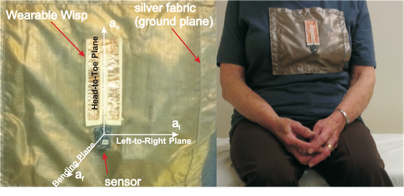
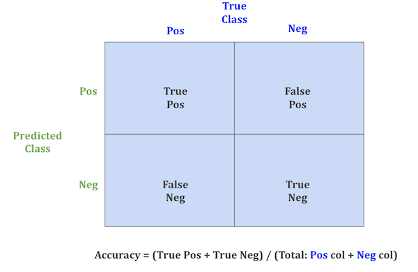
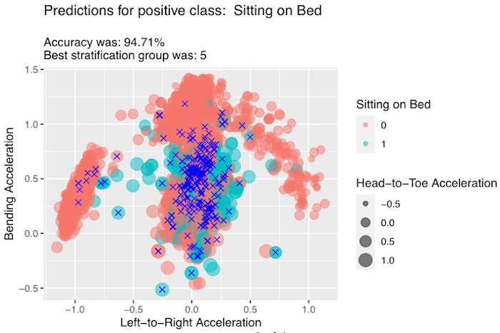
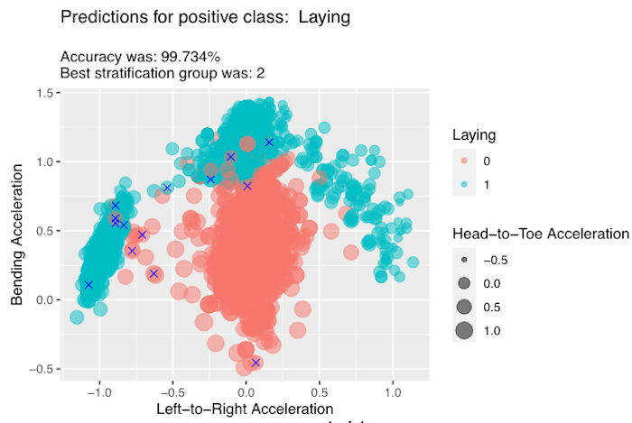
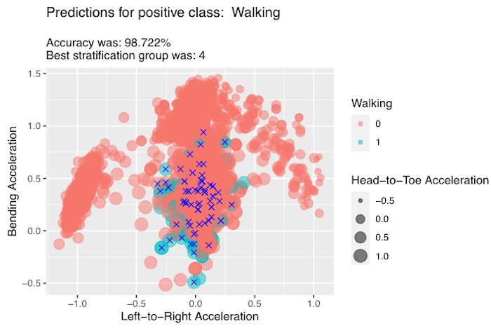
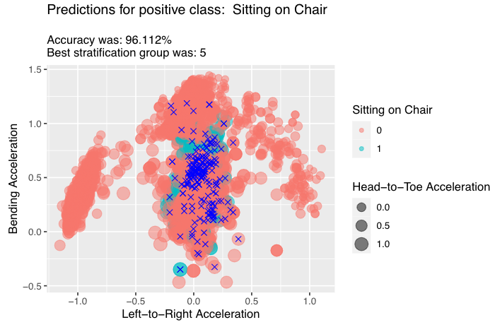

```{r global_options, include=FALSE}
knitr::opts_chunk$set(fig.pos = 'H')
```

# Introduction

Support Vector Machines (SVMs) are powerful classification and regression algorithms that work on a wide variety of problem sets. This effort looks at how SVMs perform on a multi-dimensional, multi-class classification problem of human activities based on imprecise radio-frequency identifier (RFID) sensors. This analysis provides the background of the data, explores the algorithm and its specific application, provides the results, and discusses the findings.

## Background and Objective

The source data for this effort comes from a 2013 study in Australia focused on developing a next generation solution for detecting fall risk in elderly patients in hospital care, residential care, or rehabilitation centers [1]. Traditional fall sensors are largely limited to bed pressure sensors, but they often serve as lagging indicator for a patient who has already got up and started to move.

The 2013 study looked at using novel passive radio frequency identifiers (RFID) called Wearable Wireless Identification and Sensing Platform (WISP) to measure acceleration in three planes of movement in conjunction with using Conditional Random Fields (CRFs) to classify movements into four classes of activities: 1. sitting on bed, 2. laying 3. walking, 4, sitting on chair. It included 14 individual patients and generated over 75,000 individual observations. The data generated from this study was also submitted to the University of California at Irvine Machine Learning (UCI ML) repository in 2016 [2].

Figure 1 illustrates the sensor and its axes as well as a subject wearing the sensor [1], and Table 1 provides the mapping of the sensor axes labels used in the source data to the labels used in this analysis for the sake of clarity.

```{r, sensor illustration, echo=FALSE,warning=FALSE, out.width="75%", fig.cap="Sensor"}

```

| Sensor Axes | Axes Relative to Person | Axes in Graphs |
|-------------|-------------------------|----------------|
| $a_l$       | Left-to-Right Plane     | x-axis         |
| $a_f$       | Bending Plane           | y-axis         |
| $a_v$       | Head-to-Toe Plane       | z-axis         |

: Table 1 Axes Enumeration

This analysis leverages the 2013 study's labeled data to examine the effectiveness of Support Vector Machines (SVMs) in successfully classify activities with the fundamental hypothesis that SVMs can provide a robust methodology to classify patient activities.

## Layout

Section 1 provides the introduction and background of the problem space. Section 2 describes the methodology employed. Section 3 shows the results of the analysis. Section 4 discusses the results of the analysis. Section 5 provides a summary and conclusion. Section 6 lists the references.

\newpage

# Method

This section provides a brief overview the pre-processing routines and the support vector classification methodology used.

## Pre-Processing and Accuracy

### Transformations

To enable this analysis, several pre-processing routines were employed. First, the source data from the 2013 study is hosted on the UCI ML repository website as an archive of 94 separate files with important features embedded in both the directory structure the file names themselves. Leveraging a dynamic approach, the data is imported into the R runtime as a tibble data structure and key features from the directory structure and file names are added as columns. Second, balancing the goals of cross-validated model development (described below) and challenges with applying a binary learner to a multi-class data set, the data is broken into five partitions using the same class distribution as the full data set. Third, for each partition, one-vs-all encoding is applied with several manipulations such that for each positive activity, all other activities are marked as negative. Last, the five partitions with the one-vs-all encoding markers are rejoined into a single, revised data structure such that filtering on a single data structure enables the analysis based on stratification group and positive activity class.

### Cross Validation

Aligned with the one-vs-all encoding and stratification strategy described above, a simple, five fold cross-validation scheme is leveraged. For each stratified partition, each of the four activities: "Sitting on Bed", "Laying," "Walking," and "Sitting on Chair" is held out at the positive activity. Then, that partition is further broken into a stratified 70%/30%, training/testing split. For each activity in each partition, a model is built with the training data, predictions are made with the model using the test data, and the accuracy is recorded. The model, test data, and accuracy are recorded, and the best performing model across all partitions for each activity class is retained.

### Accuracy

Accuracy for this analysis is computed in the usual way for with a confusion matrix as illustrated in figure 2. Accuracy is computed as the sum true positive and true negative classifications divided by the total number of classifications.

```{r, accuracy, echo=FALSE, warning=FALSE, out.width="50%", fig.cap="Accuracy"}

```

## Support Vector Machine Classification

Support Vector Machines (SVMs) are a useful type of linear machine learning algorithm that is particularly resilient and effective for classification and regression tasks in both low and high-dimensional datasets. The following subsection provide a brief history of SVMs and how they enable this classification based analysis.

### Support Vector Machines Brief History

SVMs lineage can be traced back to Ron Fisher's Linear Discriminate Analysis in the 1930s. However, the general SVM algorithm is more directly related to work of Vapnik and Chervonenkis in their *Theory of Pattern Recognition* in 1974 [8], and the 1992 paper *A Training Algorithm for Optimal Margin Classifiers [3]* formalized maximal margin classifiers. These maximal margin classifiers generalize first as two-dimensional support vector classifiers and in n-dimensions as SVMs. Stated plainly, SVMs follow a straightforward pattern: 1. Start with data in a low dimension, 2. Move that data to a higher dimension, 3. Find a support vector classifier to separate the higher dimensional data into two groups [4].

The particular mechanism to do approximate this higher dimension movement is to leverage a construct known as **the kernel trick**. By computing a dot product between vectors (the projection of one vector onto another) in the original space and raising the scalar result to a power, it is functionally the same as computing the dot product in a higher order space [9]. Popular kernels for this include the linear, polynomial, radial basis function, and sigmoid variants.

### Support Vector Machines Applied

For this analysis, the SVM component of e1071 R package [10] is leveraged. Building from previous experiences, the radial basis function provides strong performance and is therefore used in this analysis. As a reminder, the **radial basis function** is**:** $$
e ^ { -\gamma || \boldsymbol{u} - \boldsymbol{v}||_2} 
$$

Where **u** and **v** represent any two dimensions in the problem space, and, as is proven in [11], this euclidean norm maps into infinite dimensions.

Some additional parameters specified include the $\gamma$ value, which determines how quickly the class boundaries dissipate beyond the support vectors, and the **cost**, which as a penalty factor for misclassifying a point. Accordingly, the specific call to build the model in this analysis is:

    my_model <- e1071::svm(activity_class ~ bending + head_to_toe + left_to_right + signal_strength, 
    data = train_df, kernel = 'radial', gamma = 5, cost = 25, scale = FALSE)

\newpage

# Analysis

Aligned with the methodology described in section 2, this section provides the results of the SVM-based analysis. It begins with the summary performance information and then provides the predictions using the best model for each activity.

## Summary Performance Measures

Table 2 shows the raw accuracy metrics for each activity for each stratification. Within each stratification group, the best performing group is [**emboldened and underlined**]{.ul}.

| Activity                    | Stratification Group | Accuracy          |
|-----------------------------|----------------------|-------------------|
| Sitting on Bed              | 1                    | 94.532%           |
| Sitting on Bed              | 2                    | 94.426%           |
| Sitting on Bed              | 3                    | 94.142%           |
| Sitting on Bed              | 4                    | 94.568%           |
| [**Sitting on Bed**]{.ul}   | [**5**]{.ul}         | [**94.71%**]{.ul} |
| Laying                      | 1                    | 99.627%           |
| [**Laying**]{.ul}           | [**2**]{.ul}         | [**99.73%**]{.ul} |
| Laying                      | 3                    | 99.645%           |
| Laying                      | 4                    | 99.663%           |
| Laying                      | 5                    | 99.645%           |
| Walking                     | 1                    | 98.296%           |
| Walking                     | 2                    | 98.42%            |
| Walking                     | 3                    | 98.242%           |
| [**Walking**]{.ul}          | [**4**]{.ul}         | [**98.72%**]{.ul} |
| Walking                     | 5                    | 98.385%           |
| Sitting on Chair            | 1                    | 96.023%           |
| Sitting on Chair            | 2                    | 96.059%           |
| Sitting on Chair            | 3                    | 95.651%           |
| Sitting on Chair            | 4                    | 95.899%           |
| [**Sitting on Chair**]{.ul} | [**5**]{.ul}         | [**96.11%**]{.ul} |

: Summary Accuracy Across Stratified Groups

\newpage

## Predictions

The following sub-sections contain graphical illustrations of the predictions and errors of the best model for each activity. As a recap, each model is built using a one-vs-all approach where activities are either in the positive class or out of the positive class. Additionally, for this study the three most operationally important features are the three planes of patient movement. This means the ideal graphical rendering should depict all three planes of movement instead of applying any dimensionality reduction techniques. Accordingly, for each of the following sub-sections, in the 2D graph, the x-axis represents the Left-to-Right Acceleration, the y-axis represents the Bending Acceleration, and the z-axis represents the Head-to-Toe Acceleration as depicted by the size of the plotted point. Red dots denote negative class membership, and turquoise dots denote positive class membership. Dot opacity is set to 50% to better indicate when multiple dots overlap. Misclassified points are indicated with a blue X over the point.

### Predictions for Sitting on Bed

Figure 3 provides a graphical rendering of the model with the positive class "Sitting on Bed." Stratification group 5 provided the most accurate model for "Sitting on Bed" where it was 94.71% accurate across the test data for stratification group 5.

```{r, sitting on bed results, echo=FALSE,warning=FALSE, out.width="75%", fig.cap="Sitting on Bed Predictions"}

```

\newpage

### Predictions for Laying

Figure 4 provides a graphical rendering of the model with the positive class "Laying" Stratification group 2 provided the most accurate model for "Laying where it was 99.73% accurate across the test data for stratification group 2.

```{r, layg results, echo=FALSE,warning=FALSE, out.width="75%"}

```

### Predictions for Walking

Figure 5 provides a graphical rendering of the model with the positive class "Walking" Stratification group 4 provided the most accurate model for "Laying where it was 98.72% accurate across the test data for stratification group 4.

```{r, walking results, echo=FALSE,warning=FALSE, out.width="75%"}

```

### Predictions for Sitting on Chair

Figure 6 provides a graphical rendering of the model with the positive class "Walking" Stratification group 5 provided the most accurate model for "Laying where it was 96.12% accurate across the test data for stratification group 5.

```{r, sitting on chair results, echo=FALSE,warning=FALSE, out.width="75%"}

```

\newpage

# Discussion

Section 4 provides accuracy measurements for activities and stratification groups and provides illustrations for the best models for each activity. At face value, the classifications have remarkable accuracy ranging from low of 94.71% for the "Sitting on Bed" class to a high of 99.73% for the "Laying" class. The stratification routine applied during transformation (as described in Section 2) minimizes overfitting (due to distribution aligned sampling), and the cross-validation routine (also described in Section 2) builds and analyzes five individual models per activity class. Accordingly, this appears to be a robust analysis with colloquially "good" accuracy across the board. The follow sub-sections provide discuss some potential shortfalls and some considerations for future analysis.

## Potential Shortfalls

A significant potential shortfall for discussion is the small sample size and the lack of any time series analysis. As mentioned briefly mentioned in Section 1, there were 14 individual patients in the scope of the 2013 study that generated the 75,000+ observations leveraged in this analysis. Consecutive recording intervals from each RFID sensor ranged from 0.025 sec to 10 sec [1]; however, the approach employed in this analysis treats each observation as independent when they may not be. Future analysis could potentially further transform the data with additional features to mitigate actual dependence between consecutive observations; an approach to this is described in SVM Kernels for Time Series Analysis [5].

In retrospect, some inductive bias is likely introduced by radio frequency (RF) ignorance may have degraded the quality of the analysis. Inductive bias refers to assumptions about the transformation function that extends beyond the training data [8]. In this case, the inclusion of signal strength in model generation with the thought it would more strongly weight correct classifications was a heuristic and not based on deep analysis of RF and signal processing.

## Future Analysis

Additional analysis could be performed on different room configurations. The source study employed two different room configurations, however, in this analysis, the room identifier is excluded from the SVM model construction. Future efforts could include more rigorous analysis of different room configurations to evaluate the model accuracy from one room configuration to another, or they might include AB Tests [6] between the two rooms using the existing configuration agnostic models to identify the better sensor configuration.

Another potential area for future analysis could be to explicitly examine outliers. By design, SVM analysis excludes the outliers, but meaningful analysis of outliers could yield additional insights. For example it could identify additional data correlations. *Outlier Analysis* [7] provides several strategies for both time-series and linear discriminant (the parent family of SVM)-based analysis.

\newpage

# Conclusion

This report has provided an overview of the problem space, presented a hypothesis SVMs can provide a robust solution, walked through the basic mechanics of SVMs, and presented the analysis with discussion. To close, one question that may come up is "how does one use these models in real time in a real world setting?" The answer is to run each observation through all the models in a nested fashion. For example, given a single observation such as in Table 3:

| time   | bending | head_to_toe | left_to_right | sensor_id | signal_strength | phase  | frequency | location | gender | activity_class |
|--------|---------|-------------|---------------|-----------|-----------------|--------|-----------|----------|--------|----------------|
| 136.38 | 0.24858 | 0.33072     | -1.0172       | 2         | -49             | 2.4866 | 921.25    | two      | female | 3              |

: Exemplar Observation

Running this sample row through all four models, one can see that the model for the positive class "Laying" (activity class 3) was the one predicted positive:

    For actual: Laying:
         predicted WAS NOT Sitting on Bed 
         predicted WAS Laying 
         predicted WAS NOT Walking 
         predicted WAS NOT Sitting on Chair 

Ties could either be mitigated by stopping at the first positive classification or by random draw of all positive classes returned. Circling back, one may also question why this single example is held out as an operational example; after all, a much more thorough accuracy analysis was presented in Section 3. This example emphasizes the how the model could be used in a real environment whereas the accuracy measures from Section 3 are to empirically assess accuracy on large existing data sets.

This effort demonstrates that SVMs can classify patient activities with high accuracy using data from low-cost, low-maintenance, non-restricting RIFD sensors. Clearly, this provides evidence that SVM-based classifying algorithms could be a key solution component to a big problem space in hospital care, residential care, or rehabilitation centers.

\newpage

# References

[1] Torres, R. L. S., Ranasinghe, D. C., Shi, Q., & Sample, A. P. (2013, April). Sensor enabled wearable RFID technology for mitigating the risk of falls near beds. In 2013 IEEE International Conference on RFID (RFID) (pp. 191-198). IEEE.

[2] Torres, R. L. S. T., Ranasinghe, D. R., & Visvanathan, R. V. (2016). Activity recognition with healthy older people using a batteryless wearable sensor Data Set. UCI Machine Learning. <https://archive.ics.uci.edu/ml/datasets/Activity+recognition+with+healthy+older+people+using+a+batteryless+wearable+sensor>

[3] Boser, B. E., Guyon, I. M., & Vapnik, V. N. (1992, July). A training algorithm for optimal margin classifiers. In Proceedings of the fifth annual workshop on Computational learning theory (pp. 144-152).

[4] StatQuest with Josh Starmer. (2019, September 30). Support Vector Machines, Clearly Explained!!! YouTube. <https://www.youtube.com/watch?v=efR1C6CvhmE>

[5] Rüping, S. (2001). *SVM kernels for time series analysis* (No. 2001, 43). Technical report.

[6] STAT 88. (n.d.). *A/B Testing: Fisher's Exact Test*. STAT 88.Org. Retrieved November 14, 2020, from <http://stat88.org/textbook/notebooks/Chapter_09/02_AB_Testing_Fishers_Exact_Test.html>

[7] Aggarwal, C. C. (2016). *Outlier Analysis* (2nd ed. 2017 ed.). Springer.

[8] Hamilton, L. H. (2014, October 1). *The Inductive Biases of Various Machine Learning Algorithms*. Lauradhamilton.Com. <http://www.lauradhamilton.com/inductive-biases-various-machine-learning-algorithms>

[8] Vapnik, V. N., & Chervonenkis, A. (1974). Theory of pattern recognition, 1974. *Russian*.

[9] Ranjan, C. R. (2019, May 9). *Understanding the Kernel Trick with fundamentals*. Towards Data Science. <https://towardsdatascience.com/truly-understanding-the-kernel-trick-1aeb11560769>

[10] *e1071* (1.7-4). (2020). [Misc Functions of the Department of Statistics, Probability Theory Group]. CRAN. <https://cran.r-project.org/web/packages/e1071/index.html>

[11] University of Wisconsin. (n.d.). *The Radial Basis Function Kernel*. Cs.Wisc.Edu. Retrieved November 14, 2020, from <http://pages.cs.wisc.edu/~matthewb/pages/notes/pdf/svms/RBFKernel.pdf>
